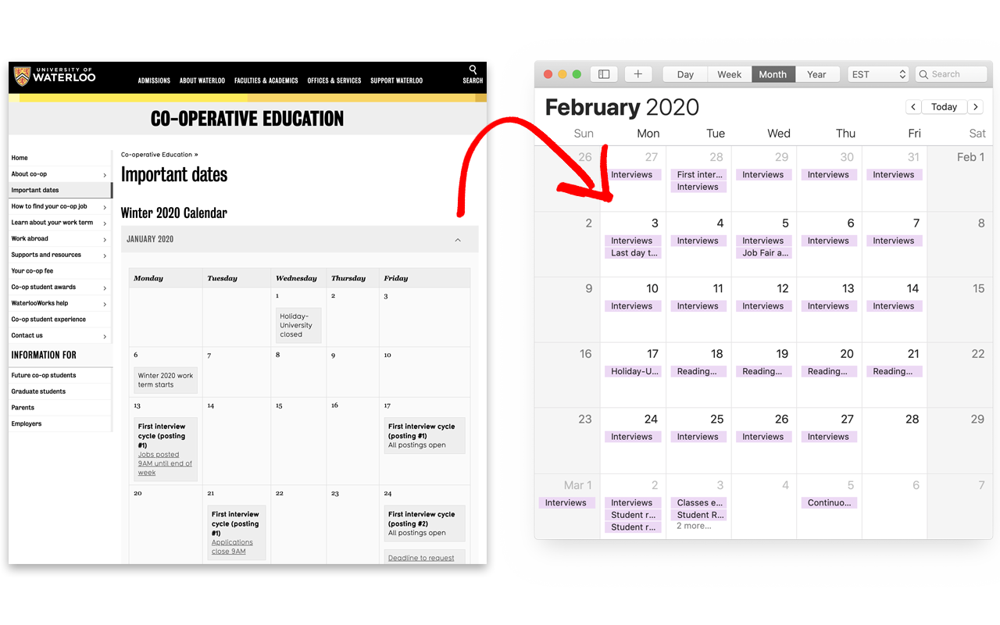

# UWaterloo Co-op Calendar Generator

A Chrome extension to generate a Calendar File (.ics) for UWaterloo's Co-op Important Dates Calendar.

## Instructions

### Install the Chrome Extension

from [here](https://chrome.google.com/webstore/detail/uwaterloo-co-op-calendar/hdfnldfohpddmphobfalkmkokpjgjbhf).

### Use the Extension

1. Go to [Co-op Important Dates Calendar](https://uwaterloo.ca/co-operative-education/important-dates)

2. Click on the extension icon from Chrome's toolbar. 

3. Import the generated .ics file in your favourite calendar app.

   Instructions for importing here:

   * [Google Calendar](https://www.lifewire.com/how-to-import-ics-calendar-files-in-ical-1172177)
   * [Mac Calendar App](https://www.lifewire.com/how-to-import-ics-calendar-files-in-ical-1172177)
   * [Outlook](https://support.office.com/en-us/article/import-or-subscribe-to-a-calendar-in-outlook-on-the-web-503ffaf6-7b86-44fe-8dd6-8099d95f38df)

## Known Issues

None yet :)

Please open an issue on Github for bugs and feature requests.

## Thanks to

* [nwcell/ics.js](https://github.com/nwcell/ics.js/)
* [jquery/jquery](https://github.com/jquery/jquery)

